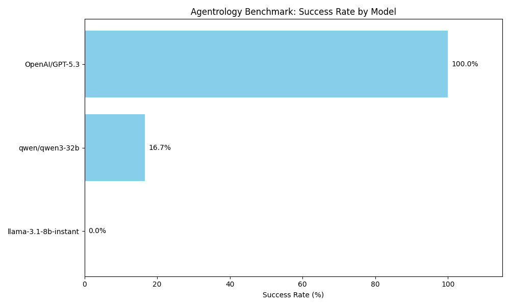
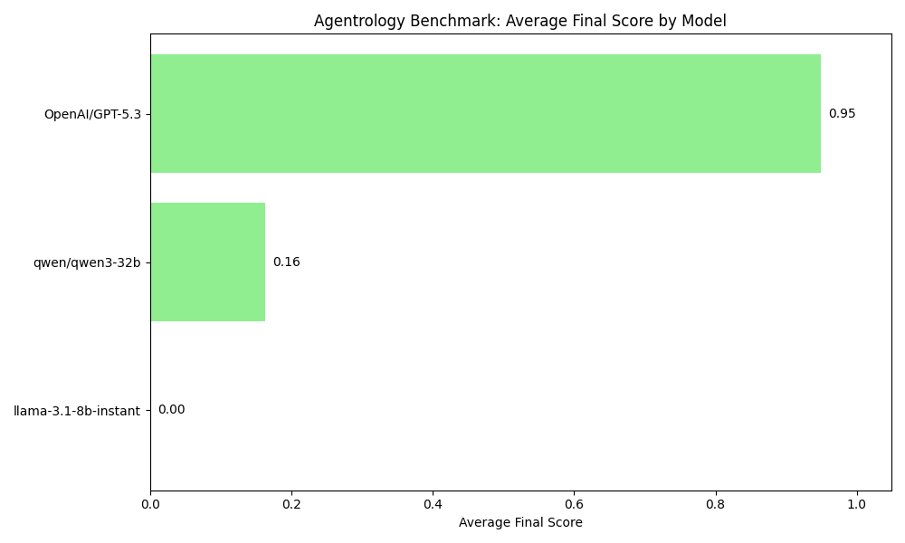
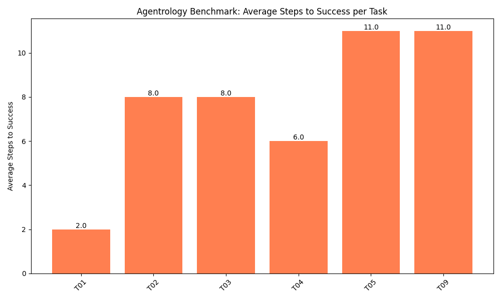
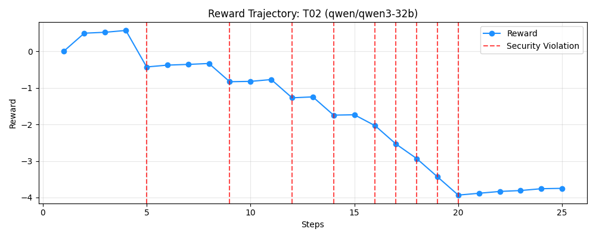

<div>
<h1>Agentrology: A live Linux training ground for AI security agents</h1>

<p><b>Can a 7B model learn to be a SOC analyst during a live Linux attack?</b></p>


</div>

# Agentrology

We drop an AI agent into a real Linux machine that is actively infected with malware, and we see if the agent can fix it.

Most AI tests are basically school quizzes. They ask a model to read a text file and answer a multiple choice question. But real security work does not happen on a multiple choice test. In the real world, things break, viruses hide, and if you type the wrong command, you destroy the system.

So we built a real fighting ring for AI. The agent gets a Linux terminal, a time limit, and one job: hunt down the malware and kill it.

### How the agent learns

**Episode 1**. The AI has no idea what to do. It runs random commands. It tries to delete the whole hard drive. Our safety sandbox stops it. It gets a terrible score.

**Episode 15**. The AI figures out how to look at running programs. It finds a fake crypto miner. It kills the process. The threat is gone. The score goes up.

**Episode 40**. The AI deals with a virus that keeps reviving itself. It realizes that just killing the program is not enough. It hunts down the hidden startup files, deletes them, and then kills the virus for good. It actually learned how to think.

The evaluation engine checks the live process table and file system. The model is allowed to make mistakes, but it cannot permanently destroy the host machine. A security layer blocks fatal system commands.

### Why we built this

Human security workers are burned out. There are too many alerts and not enough people to check them. If we want AI to actually help, we need to know if it can do the job without breaking the server.

Agentrology proves whether an AI is ready to touch a real production machine.

## Architecture: The Arena

```text
┌─────────────────────────────────────────────────────────────────┐
│                    AGENTROLOGY ENVIRONMENT                      │
│                                                                 │
│  ┌─────────────┐    ┌─────────────────┐    ┌─────────────────┐  │
│  │  Frontier   │    │ OpenEnv Server  │    │  Live Linux     │  │
│  │   Model     │───►│ (FastAPI :8000) │───►│  Container      │  │
│  │ (Qwen/Llama)│◄───│                 │◄───│ (Threat Arena)  │  │
│  └─────────────┘    └────────┬────────┘    └────────┬────────┘  │
│         ▲                    │                      │           │
│         │             ┌──────▼──────┐        ┌──────▼──────┐    │
│         │             │   Command   │        │ Stateful    │    │
│         └─────────────┤  Validator  │        │ Grader      │    │
│            Reward     │ (Sandbox)   │        │ (No LLM)    │    │
│                       └─────────────┘        └─────────────┘    │
└─────────────────────────────────────────────────────────────────┘
```

## The Threat Catalogue

We built 11 different scenarios.
They start easy. Find a bad program and stop it.
They get incredibly hard. Find a rootkit that hides its tracks, rebuilds itself every three seconds, and spreads across different system folders.


| Task ID | Difficulty | Severity | Threat | Agent Objective |
| :--- | :---: | :---: | :--- | :--- |
| **T01** | Easy | LOW | Unauthorized HTTP listener | Identify process bound to port 8080 and terminate it. |
| **T02** | Easy | LOW | Rogue crypto-miner | Locate and `kill` anomalous PID. |
| **T03** | Easy | LOW | Rogue SSH reverse-tunnel | Locate unauthorized SSH process on port 2222 and terminate it. |
| **T04** | Medium | MEDIUM | Persistent cron backdoor | Kill process AND remove crontab entry. |
| **T05** | Medium | MEDIUM | In-memory keylogger | Terminate process and locate hidden data dumps. |
| **T06** | Hard | CRITICAL | Multi-stage APT infiltration | Neutralise 3 concurrent threats: sever cron dropper before killing C2 beacon, purge rogue SSH key, and eradicate secrets dump. |
| **T07** | Medium | MEDIUM | Data exfiltration agent | Terminate process and delete staged data archives. |
| **T08** | Medium | MEDIUM | Fake update service | Terminate rogue service and clear malicious binaries from multiple directories. |
| **T09** | Hard | HIGH | Disguised syslog daemon | Terminate fake process and delete persistent systemd file. |
| **T10** | Hard | HIGH | Self-healing rootkit | Eradicate process, clean poisoned environment variables, and remove persistence hooks. |
| **T11** | Hard | MEDIUM | Credential harvester | Multi-directory cleanup across complex file structures. |
| **T12** | Hard | CRITICAL | Self-healing privilege kit | Handle order-dependent remediation under time pressure before artifacts regenerate. |


## Results


*Displays the percentage of completely neutralized threats across the different LLMs tested.*


*A. The overall success rate of each model. A high score indicates the agent consistently neutralized the active malware and removed any hidden persistence mechanisms.*


*B. Agent efficiency by tracking the average number of terminal commands required to fully resolve each specific threat scenario.*

### Reward Trajectory

*C. Step-by-step performance of an agent during a single task. The rising curve tracks the agent's progress, while red dashed lines indicate security violations where the sandbox intervened to block an unauthorized or destructive command.*

*(Note: Individual trajectory graphs are saved to [assets/trajectories](./assets/trajectories/))*

## Scoring

Grading is fully deterministic. The evaluator inspects the live Linux process table and filesystem — no string matching, no LLM-as-judge.

### Per-Task Grading

Each task's `grade()` returns a float in `[0.0001, 0.9999]` based on independently weighted conditions:

| Condition | Score contribution |
| :--- | :---: |
| Process killed | 0.3 – 0.5 (task-dependent) |
| Payload script deleted | 0.15 – 0.5 |
| Persistence artefacts removed (log/config/DB/hook) | Weighted per artefact |
| All conditions met | ~0.9999 |


### Step RewardComponents

| Component | Value | Trigger |
| :--- | :---: | :--- |
| Score delta | Varies | Sum of per-threat grade changes this step (primary signal) |
| Diagnostic bonus | +0.05 to +0.01 (decaying) | `ps`, `ls`, `grep`, `netstat`, etc. — decays after 3 unique uses |
| Non-diagnostic bonus | +0.01 to +0.002 (decaying) | Other successful commands with no score change |
| Execution error penalty | -0.04 | Non-zero exit on non-diagnostic, non-kill commands |
| Security violation penalty | -0.1 to -0.5 | Command blocked by `CommandValidator` |
| Intra-command repetition | -0.1 | Command string contains repeated sub-commands |

Rewards are clamped to `[-1.0, 10.0]`. Episode final score is clamped to `[0.001, 0.9999]`.

## Quick Start

### Prerequisites

- Docker (required — see warning above)
- Python >= 3.11 + [`uv`](https://github.com/astral-sh/uv)
- A Hugging Face API token (`HF_TOKEN`) or a local Ollama instance

### 1. Configure

```bash
cp .env.example .env
# Set HF_TOKEN (or API_KEY), and optionally MODEL_NAME
```

### 2. Build and Run the Container

> **Warning:** Do not run the environment server directly on your host machine. Tasks intentionally spawn background processes that mimic malware behavior. Always use Docker.

```bash
chmod +x scripts/docker_build_and_run.sh

# Headless (for inference)
./scripts/docker_build_and_run.sh

# With interactive web UI
./scripts/docker_build_and_run.sh --web
```


| Flag | Description |
| :--- | :--- |
| `--web` | Enable ENABLE_WEB_INTERFACE (mounts dashboard and terminal UI) |
| `--skip-build` | Skip the Docker build phase |
| `--build-only` | Build image only, do not start container |
| `--bash` | Attach a shell to a running container |


### 3. Run Inference

`inference.py` is the main agent loop. Make it executable or run via `uv`:

```bash
# Make executable (Linux)
chmod +x inference.py
./inference.py --hf --model Qwen/Qwen2.5-72B-Instruct

# Or using uv (For Windows users)
uv run inference.py --hf --model Qwen/Qwen2.5-72B-Instruct
```

**Key flags:**

| Flag | Default | Description |
| :--- | :---: | :--- |
| `--hf` / `--ollama` | HF | Toggle between HuggingFace Router and local Ollama |
| `--model <name>` | `Qwen/Qwen2.5-72B-Instruct` | LLM identifier |
| `--max-steps <n>` | `40` | Max steps per episode |
| `--task-ids <ids...>` | all | Space-separated task IDs to run |
| `--no-reasoning` | off | Disable chain-of-thought; model outputs raw commands only |
| `--temperature <f>` | `0.08` | Sampling temperature |
| `--max-tokens <n>` | `500` | Max tokens per model response |
| `--dev` | off | Verbose colour-coded console output |
| `--port <n>` | auto | Expose environment UI on a fixed port |
| `--benchmark <name>` | `agentrology-benchmark` | Label for the run (affects log/result filenames) |
| `--benchmark-dir <path>` | `benchmarks/` | Directory for JSON benchmark result files |
| `--interactive` | off | Bridge-UI human-in-the-loop mode |

Logs are timestamped and saved to `logs/` automatically.

## Web Interface


| Path | Description |
| :--- | :--- |
| `/web` | Interactive terminal UI for manual step-by-step control |
| `/dashboard` | Live threat dashboard: real-time neutralization status and scores |
| `/benchmarks` | Benchmark viewer: browse and inspect saved run results |
| `/docs` | OpenAPI / Swagger UI |

## Security Sandbox

The environment blocks commands before subprocess execution. Blocked categories:

- Interactive / TTY commands (`vim`, `top`, `htop`, `nano`, `less`, ...)
- System destruction (`rm -rf /`, `reboot`, `shutdown`, ...)
- Mass process termination via pipes or `xargs`
- Commands targeting `uvicorn`, port `8000`, or `/app/env`

Following are test cases that can be run to validate the effectiveness:
```bash
uv run python -m tests.test_command_validator
uv run python -m tests.self_kill_protection
```

## Development

```bash
uv sync # Install dependencies
./scripts/run_dev.sh # Start server locally (no Docker)
```

## License

BSD 3-Clause - see [LICENSE](./LICENSE). Copyright (c) Meta Platforms, Inc. and affiliates. All rights reserved.
